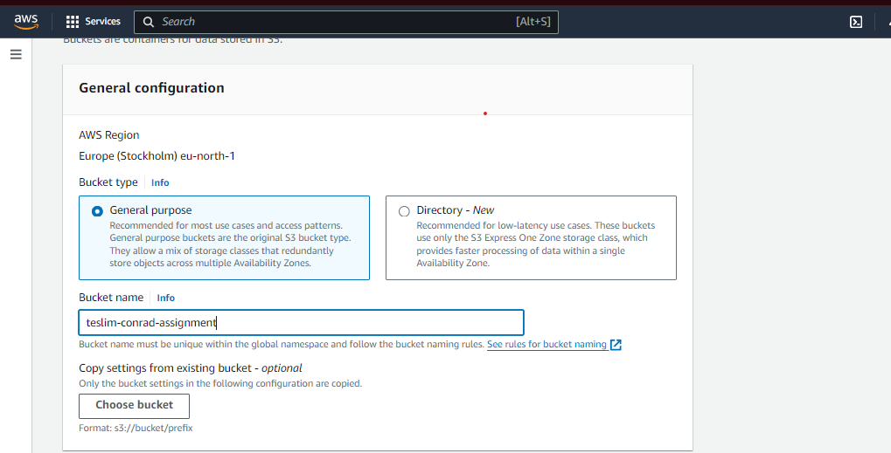
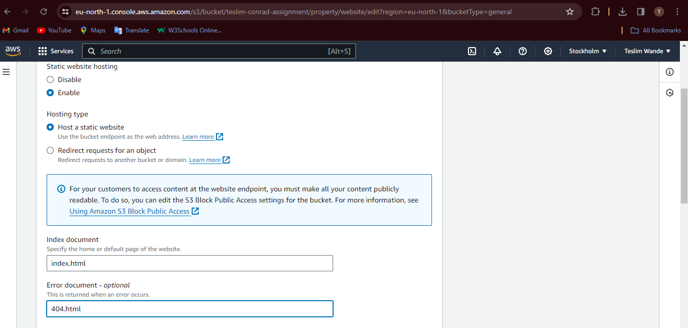
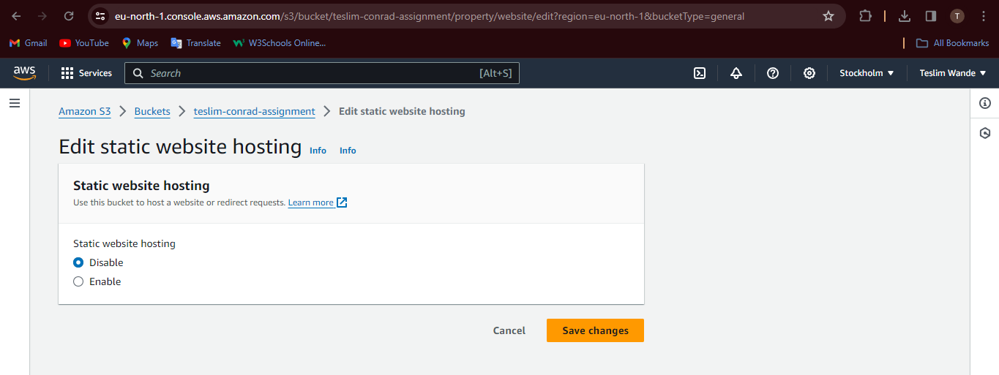

# Third-semester-first-assignment---S3-static-web-hosting
Utilizing the AWS S3 bucket and Cloudfront to host a static website

#### The aim of the assignment is to host a static website, using the AWS S3 bucket and Cloudfront to make the contents of the bucket accessible by the public without having to make the S3 bucket public.

## Requirements
1. An AWS account
2. A S3 bucket
3. An AWS cloudfront distribution.

## Steps to do this
1. Create a S3 bucket on the AWS console, after which the newly created S3 bucket will be edited (name the bucket accordingly; with a unique name that has not been previously used by any other AWS user)

2. Ensure you tick on the button that allows your bucket to host a static website while creating your newly created bucket. Also make sure the access to the bucket remains public; set a default home page for the website, which is "index.html" by default and also an error document, which will be the error message that pops up whenever an error occured e.g "404.html". Leave every other default settings as they are and scroll down to the page end to click "create bucket"

3. Once the bucket has been created, click on the upload button to upload your webpage file or folder (as the case may be), clicking "add files" or "add folders" for each case. Once the files/folder(s) have been successfully uploaded, you can then proceed to move the objects to the rot directory of your bucket.

4. After the objects have been moved, we can then proceed to the Cloudfront page to create a cloudfront distribution, which is going to serve as our content delivery network (CDN), that allows serves users the content of our bucket, without getting access to the main bucket itself.

